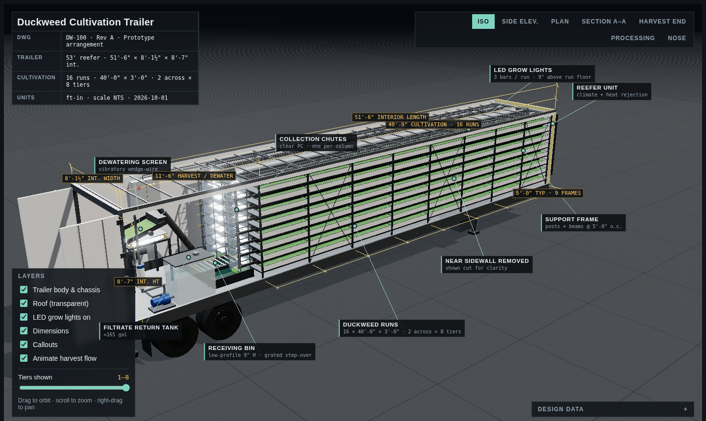
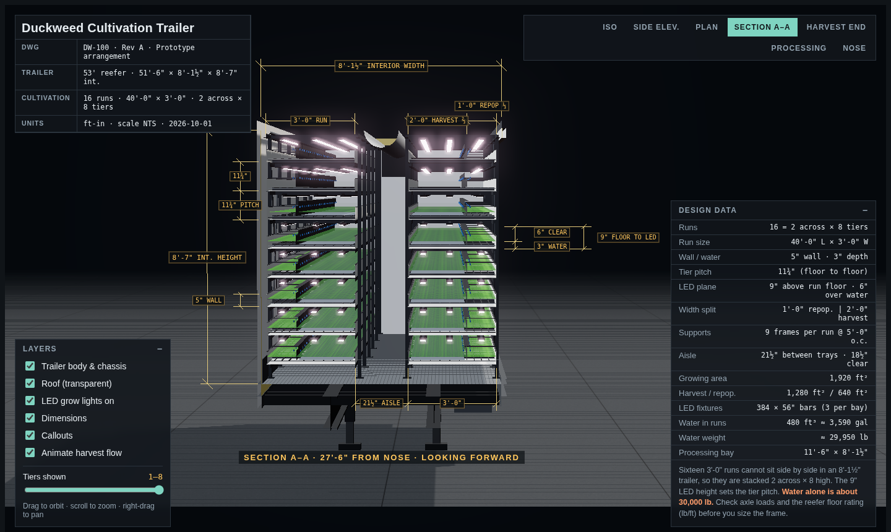
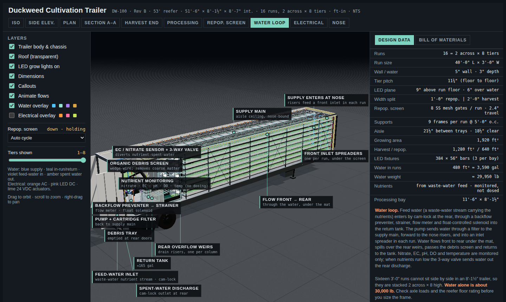
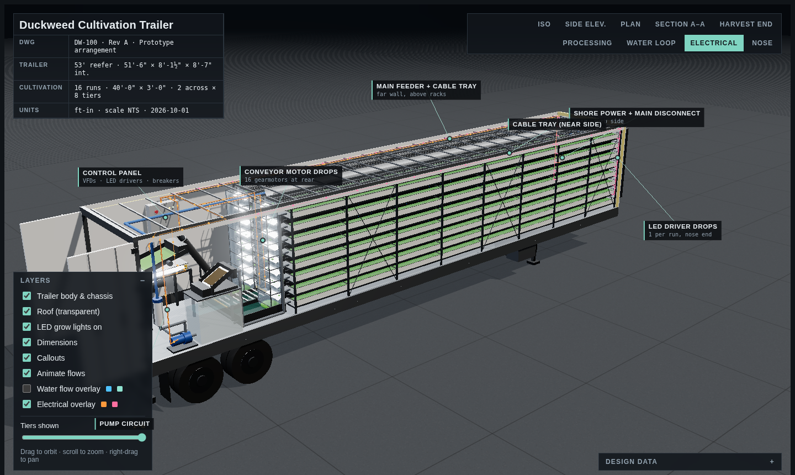
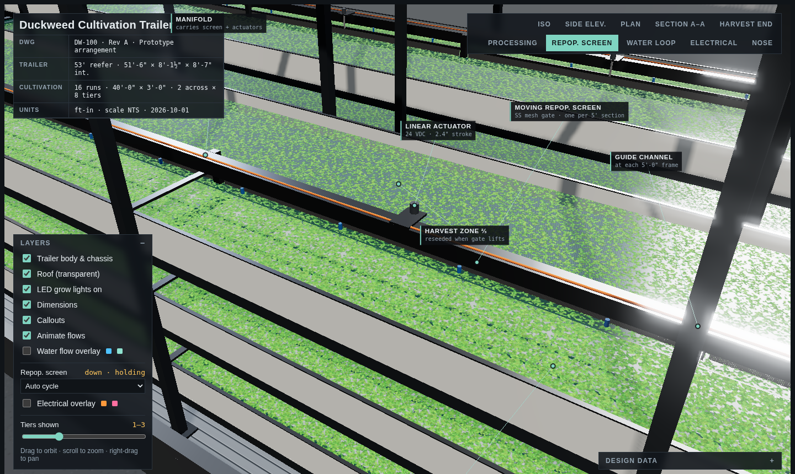
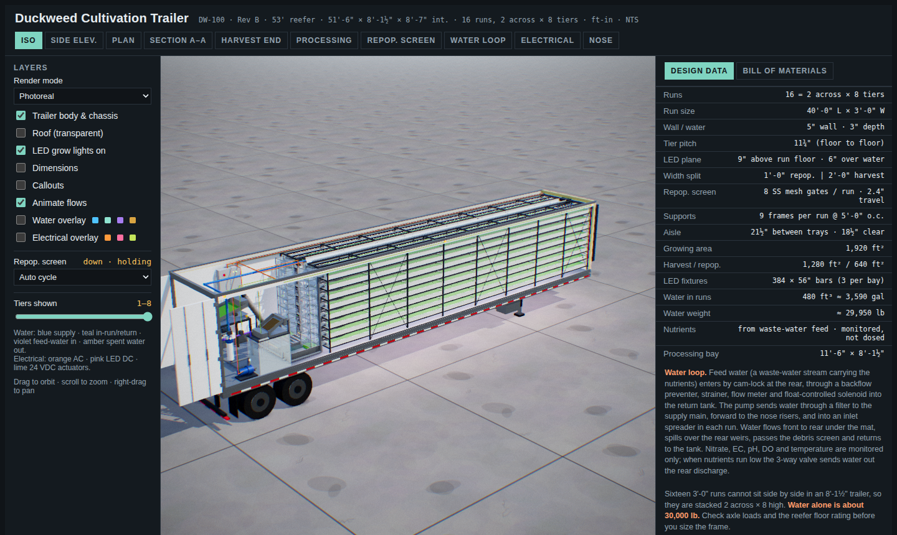
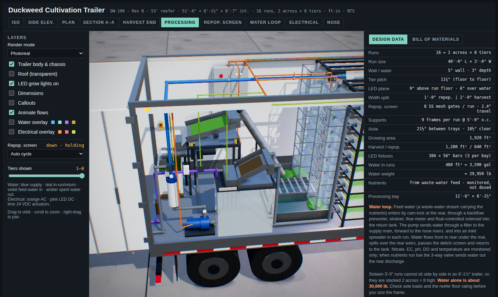

# Duckweed Cultivation Trailer

Interactive 3D engineering model (Three.js) of a 16-run duckweed cultivation and harvest system inside a 53' reefer trailer (51'-6" × 8'-1½" × 8'-7" interior).

- 16 runs, 40'-0" × 3'-0", arranged 2 across × 8 tiers (11¾" tier pitch)
- 5" walls, 3" water, LEDs 9" above run floor
- Manifold splits each run ⅓ repopulation / ⅔ harvest; submerged conveyor lifts biomass to a discharge flap and collection chute
- Rear 11'-6" processing bay: receiving bin, auger, dewatering screen, screw press, return tank

Open `index.html` in a browser. Views: Iso, Side, Plan, Section A–A, Harvest end, Processing, Water loop, Electrical, Nose.

Water loop (nutrients come from a waste-water feed stream; monitored, not dosed): feed water enters by cam-lock at the rear → backflow preventer → Y-strainer → flow meter → float-controlled solenoid → return tank. Then supply main → risers at the nose → an inlet spreader on the floor of each run (passing under the screen) → flow front to rear through the water → rear overflow weirs → organic debris screen → return tank → pump + cartridge filter → supply main. An EC/nitrate sensor and motorised 3-way valve after the filter divert nutrient-spent water to a cam-lock discharge outlet at the rear sill.

Electrical: shore power + main disconnect (nose) → feeder in wall-side cable trays → control panel (VFDs, LED drivers, breakers) → LED driver drops at the nose end of each run, conveyor gearmotor drops at the rear, pump, auger, screen and press circuits.

Repopulation screen: a stainless mesh gate on the 1/3 line of every run (one 58" panel per 5' section, running in guide channels on the manifold). A 24 VDC linear actuator per section moves it 2.4": down, the panel sits 1.4" into the water and holds the repop mat; up, it clears the surface by 1" so the mat can spread into the harvest zone.

Screen actuators: 24 VDC circuits drop at the nose to a junction box per run, then a harness along each screen rail with a whip to every actuator.

## Bill of materials
The page's **Bill of materials** tab lists ~70 off-the-shelf products (everything except the duckweed run trays), grouped by system: trailer & climate, rack & screen mechanics, conveyors, lighting, water loop, harvest & dewatering, electrical & controls. Models are representative; confirm sizing, ratings, wet-location suitability and lead times before ordering.

## Photoreal mode
Default render mode: sky-dome lighting, ambient occlusion (GTAO), LED area lights over every run, procedural surface detail (brushed stainless, powder coat, duckweed fronds with normal maps, rippling water, tire tread, concrete yard), DOT conspicuity tape and marker lights, and a filmic grade. Switch to Engineering mode in the Layers panel for the original drawing look.

