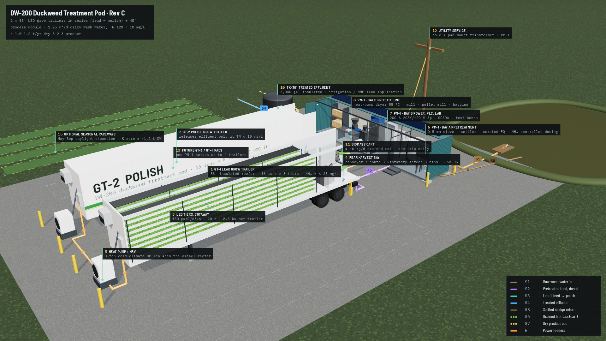

# DW-200 Duckweed Treatment Pod: System Design (Rev C)

A transportable, year-round wastewater treatment system that uses duckweed to remove nitrogen, phosphorus and some organic matter, then turns the harvested biomass into a dry fertilizer product. It builds on the DW-100 grow trailer in `index.html` and adds the parts needed for a full system: front-end pretreatment, series operation, a product line and a site package.

- Interactive site rendering: open [`site.html`](site.html) in a browser
- Trailer interior model: [`index.html`](index.html)
- Process flow diagram: [`pfd.svg`](pfd.svg)
- Sizing model behind every number here: [`model/mass_balance.py`](model/mass_balance.py)



---

## 0. Summary

| | One pod (2 grow trailers + 1 process module) |
|---|---|
| Footprint | ~95' × 75' gravel pad, plus pads for 2 future trailers |
| Growing area | 3,840 ft² (357 m²), 16 runs × 8 tiers stacked in each trailer |
| Wastewater treated (design stream: screened dairy parlor wash water, 120 mg/L TN) | **1.25 m³/d (331 gal/d)**, TN 120 → 10 mg/L |
| Same pod on a dilute stream (aquaculture effluent, 30 mg/L TN) | 5.5 m³/d (1,450 gal/d) |
| N / P removed in biomass | 48–61 kg N/yr · 8–10 kg P/yr |
| Dry product | 1.0–1.2 t/yr of duckweed meal or pellets, ≈ 5-2-3 (N-P₂O₅-K₂O) |
| Electricity | ≈ 500 kWh/d (183 MWh/yr), 85% of it LED lighting |
| Peak electrical demand | ≈ 46 kW; 200 A, 208 V 3-phase service |
| Labor | ≈ 1 h/day plus a 3–4 h product day each week |

**What drives the design.** Duckweed removes nutrients only as fast as it grows, and in a closed box it grows only as fast as the LEDs supply light. Every trailer is therefore limited to about 70–90 g N/day, whatever the wastewater strength. Stronger wastewater does not raise the capacity; it only shrinks the flow a trailer can take. On grid power at $0.11/kWh the system spends about $16–20 of electricity per kg of dry product, so neither treatment fees nor a commodity fertilizer price covers it alone. Rev C is built around that limit:

1. **Get the most growth from each kWh.** Moderate PPFD on a long photoperiod (best g/mol), dimmable 3.0 µmol/J LEDs, LED heat reused to heat the space in winter, the dark period moved to the utility's on-peak window, and optional CO₂ enrichment.
2. **Lose no captured nutrient.** The trailer screw press is removed from the fertilizer line, because press juice carries N and P back to the water. A low-temperature heat-pump dryer dries the drained mat directly; at this scale that costs about 4% of pod energy.
3. **Treat to a limit, not to a volume.** Feed-on-demand dosing controlled by an ammonium sensor, and lead → polish trailers in series, so effluent quality is controlled and ammonia never reaches toxic levels.
4. **Site it where power is cheap and the stream is right.** The best host is a dairy or food plant with an anaerobic digester: low-cost power and waste heat, biogas CO₂, a nutrient stream, and an existing nutrient management plan for the effluent. At $0.04/kWh the break-even product price falls to about $7.50/kg (§8.4).
5. **Sell the product for more than a commodity price.** Bagged specialty organic fertilizer first; a protein or extraction line (the press moves here) when volume justifies it.

---

## 1. Basis of design

| Parameter | Value | Note |
|---|---|---|
| Location | Wisconsin; ambient −25 °F to 95 °F | Enclosed, insulated modules |
| Grow trailer | DW-100 geometry: 16 runs 40'-0" × 3'-0", 2 across × 8 tiers, 3" water | 1,920 ft² / 178 m² per trailer, 13.6 m³ water |
| Species | *Lemna minor* / *Lemna gibba* local isolates; *Spirodela polyrhiza* as backup | Use local isolates: hardy and permit-friendly |
| Light | 130 µmol/m²/s × 20 h = DLI 9.4 mol/m²/d | Red/blue-rich white LED, 3.0 µmol/J |
| Light-use efficiency | 0.75 g DW/mol design, 0.95 target | → 7.0–8.9 g DW/m²/d |
| Standing crop | ~600 g fresh/m² after spreading, harvested on a 4–5 day rotation | RGR 0.19–0.25/d |
| Tissue composition (wastewater-grown) | N 5.5%, P 0.9%, K 3.0% of DW; crude protein ~34% | Confirm by lab after start-up |
| Water | 22–28 °C, pH 6.5–7.5, NH₄-N ≤ 30 mg/L (lead), DO > 2 mg/L | Free NH₃ is the toxicity limit |
| Air | 24 °C day / 21 °C dark, RH 65–80%, CO₂ 400 (800 optional) ppm | |
| Operating days | 350/yr | 2 weeks for cleaning and maintenance |

**Wastewater streams that fit** (capacity per trailer, from the model; plant uptake only):

| Stream | TN in → out | Feed per trailer | Fit |
|---|---|---|---|
| Aquaculture (RAS) effluent | 30 → 5 mg/L | 2.8–3.5 m³/d (730–920 gal/d) | Best: low BOD, N-rich, clean |
| Dairy parlor / milkhouse wash water, screened | 120 → 10 mg/L | 0.63–0.79 m³/d (165–210 gal/d) | Good with aerated pretreatment; keep copper-sulfate footbath dumps out |
| Lagoon or digestate supernatant | 600 → 10 mg/L | 0.12–0.15 m³/d (31–39 gal/d) | Polishing only; needs 5:1 or more dilution |
| Cheese / whey wash water | High BOD | — | Not suitable without aerobic treatment first |

Nitrification and denitrification on the run walls and biofilm usually add 20–40% more N removal. The design does not count it.

---

## 2. System architecture

```
 WASTEWATER SOURCE ──► PROCESS MODULE (40' HC container) ──────────► PRODUCT
   lagoon / sump          Bay A  Pretreatment & dosing                   bagged meal / pellets
                          Bay B  Electrical, controls, lab
                          Bay C  Drying, milling, pelletizing, bagging
                               │ dosed feed            ▲ drained biomass (lidded bins)
                               ▼                       │
                     GT-1 LEAD trailer ──bleed──► GT-2 POLISH trailer ──► TREATED EFFLUENT
                     (53' insulated reefer)       (53' insulated reefer)    3,000 gal tank →
                                                                            irrigation / NMP land application
```

**Modules**

| Tag | Module | Transport | Shipping weight |
|---|---|---|---|
| GT-1, GT-2 | Grow trailer, DW-100 Rev C (53' reefer, 16 runs, rear processing bay) | Standard tractor, legal load, **always drained** | ≈ 21,000 lb dry (trailer 15,500 + rack/trays/LED/belts ≈ 5,500) |
| PM-1 | Process module, 40' high-cube container | Tilt-deck rollback or flatbed + crane | ≈ 14,000 lb |
| TK-301 | Effluent tank, 3,000 gal vertical poly, insulated | Flatbed | 600 lb |
| — | Site kit: cribbing, cable protectors, pre-insulated PEX/HDPE hose, cam-locks, mini-split stands | In PM-1 | — |

**Site layout (see `render-site-plan.png`).** The trailers park side by side, noses west, with 11'-6" between them for service access. PM-1 sits across the rear doors, 16' away, so biomass moves out of each trailer's rear processing bay and straight across to Bay C on a hand cart. Pads for GT-3 and GT-4 sit north and south of the pair, so one process module serves up to four trailers. Utility service lands at PM-1. Power and water run to the trailers in surface cable protectors and pre-insulated, heat-traced hose, so no trenching is needed.

---

## 3. Process flow and mass balance

See [`pfd.svg`](pfd.svg). Design case: screened dairy parlor wash water, design yield, GT-1 and GT-2 in series.

| # | Stream | Flow | TN | TP | Notes |
|---|---|---|---|---|---|
| S1 | Raw wastewater to screen | 1.29 m³/d | 120 mg/L | 25 mg/L | includes ~3% sludge purge |
| S2 | Pretreated feed, dosed to GT-1 | 1.25 m³/d (331 gal/d) | 120 | 25 | BOD reduced ~70–85% in aerated EQ |
| S3 | GT-1 bleed → GT-2 | 1.25 m³/d | 65 | 16 | |
| S4 | Treated effluent | 1.25 m³/d | **10** | 7 | to TK-301 → irrigation / land application |
| S5 | Condensate, returned inside each trailer | 223 L/d each | ~0 | ~0 | closes the water balance |
| S6 | Drained biomass → PM-1 | 46 kg/d | 5.5% DS | | two 20-gal lidded bins |
| S7 | Dried product | 2.8 kg/d | 5.0% N | 0.81% P | 90% DS; ~20 kg/week |
| S8 | Settled sludge | ~40 L/d | | | returned to manure storage |

Phosphorus comes out about 70% removed because dairy water carries more P than duckweed's ~6:1 N:P uptake ratio. If the effluent has a P limit, add the optional iron-media P polishing column on S4 (one 24" × 72" vessel, about 1 m³/d).

---

## 4. Goal 0: Treat the wastewater

### 4.1 Pretreatment (PM-1, Bay A)
| Step | Equipment | Purpose |
|---|---|---|
| Intake | Submersible solids-handling pump with float switch in the source sump/lagoon (Tsurumi HS2.4S class, ⅓ hp), 1½" pre-insulated, heat-traced HDPE line, cam-lock at PM-1 | Draws 1.3–6 m³/d in short timed runs |
| Screening | Static wedge-wire sieve, 0.5 mm (Hycor HydroSieve, smallest unit) | Removes hair, bedding and feed fines |
| Settling | TK-101: 550 gal cone-bottom poly tank, weekly sludge draw | Removes settleable solids and some organic N/P |
| Aerated EQ | TK-102: 550 gal cone-bottom with 30% fill K1-type moving-bed media; linear blower (Hiblow HP-80, 80 L/min, 70 W) on fine-bubble diffusers | 3+ days aerated HRT: BOD down 70–85%, partial nitrification (less free ammonia), steady feed quality |
| Feed tank | TK-103: 300 gal, low-speed mixer; ammonium/nitrate ISE + pH probe | Holds the measured feed |
| Dosing | One peristaltic metering pump per trailer (Watson-Marlow Qdos 30 class, 0–2 L/min, 4–20 mA) to the trailer return tank | Feed-on-demand |

### 4.2 Feed-on-demand control (replaces Rev B's float-and-solenoid raw feed)
The PLC calculates each trailer's nitrogen demand from the last 24 h of harvest weight × tissue N plus the run NH₄-N trend, and doses feed in small pulses through the photoperiod:

- **GT-1 (lead):** dose until run NH₄-N reaches 25 mg/L; hard stop at 30 mg/L or pH > 7.6. The lead trailer grows at full rate.
- **GT-2 (polish):** its only feed is GT-1 bleed, taken from GT-1's rear weir (the most-treated point in that trailer) whenever GT-1 doses. Effluent leaves GT-2's rear weir through the motorized 3-way valve only when TN < 10 mg/L (nitrate + ammonium ISE, verified by weekly grab sample); otherwise it recirculates.
- **Water balance:** condensate from each trailer's dehumidification returns to its own return tank, so bleed ≈ feed. A make-up float only refills with treated effluent from TK-301, never fresh water.
- **Pod in series (more trailers):** GT-3/GT-4 slot in as lead–lead–polish–polish. The sizing rule is the same: capacity = Σ trailer N uptake ÷ (TN in − TN out).

### 4.3 Organic matter
Duckweed is not a BOD-removal process: a thick mat shades the water and lowers DO. Rev C handles organic load in TK-102 and keeps run DO above 2 mg/L. The rear weirs aerate by cascade, and the organic debris screen (Rev B) stays. If run DO falls below 2 mg/L, the PLC cuts the dose rate and raises recirculation.

### 4.4 Effluent destination
TK-301 (3,000 gal, about 9 days at design flow) sends effluent to the host's irrigation or land application under its nutrient management plan. With no surface discharge, a separate WPDES discharge permit is usually unnecessary. Confirm with the WDNR regional wastewater engineer before installation (§11).

---

## 5. Goal 1: Year-round enclosed growing in Wisconsin

### 5.1 Thermal balance (per trailer)
| Condition | Heat in | Heat out | Result |
|---|---|---|---|
| Winter design, −20 °F, lights on | LED 8.6 kW + pump 0.75 kW | Envelope (UA ≈ 100 W/K) 5.3 kW + HRV ventilation 2.1 kW | **Surplus.** No heater needed; the economizer dumps the excess |
| Winter, 4 h dark | 13.6 t of water stores ≈ 16 kWh/K | 7.4 kW for 4 h | Water drops ~1.3 °C, recovered in the photoperiod. 3 kW backup heater as insurance only |
| Summer, 95 °F | LED + pump + envelope + solar ≈ 11–12 kW | 3-ton inverter heat pump | Mini-split carries both sensible and latent load |
| Spring/fall, < 60 °F outside | | Outside-air economizer through the HRV bypass | Fans only |

Rev C replaces the diesel reefer unit with a **3-ton cold-climate inverter heat pump** (Mitsubishi Hyper-Heat class, ducted into the Rev B fabric air chute) plus a **sensible-only HRV, ~450 cfm, with economizer bypass**. A reefer unit is built for 0 °F cargo and runs at roughly half the efficiency of an inverter heat pump at a 75 °F box. Sell the reefer unit to offset cost.

### 5.2 Humidity
Evapotranspiration is about 1.25 mm/d, or 223 L/d per trailer (§1 model). In winter, the HRV exhausts humid air and brings in cold, dry air, removing ~11 kg/h of water at ~450 cfm. In summer, the heat-pump coil condenses it. In the shoulder seasons, a dehumidifier (Quest 506 class) on a humidistat holds RH below 80%. All condensate drains to the trailer return tank (S5). Hold RH at 65–80%: duckweed tolerates high humidity, but racks and electrics corrode above 85%.

### 5.3 Light recipe and schedule
- 130 µmol/m²/s at the mat, 20 h on. Duckweed saturates early, so moderate PPFD on a long day gives more grams per mol than high PPFD on a short day.
- The 4 h dark period runs during the utility on-peak window (e.g., 1–5 pm in summer). This cuts demand charges, and the HVAC runs at its lightest load in the hottest hours.
- 0–10 V dimming on the Rev B Mean Well drivers. The PLC trims PPFD per tier from quarterly PAR-meter mapping.
- Fixture count is unchanged (384 × 22 W ≈ 8.6 kW). When fixtures are replaced, specify ≥ 3.0 µmol/J. Each +0.3 µmol/J saves ~10% of lighting energy.

### 5.4 Optional CO₂ enrichment
Duckweed growth responds strongly to CO₂ up to ~800–1,000 ppm. On a digester site, scrubbed CO₂ from biogas upgrading (or a bulk CO₂ tank) feeds through a solenoid on an NDIR sensor (Vaisala GMP252 class). Enrich only while the HRV is on recirculation or minimum air. Expected gain is +15–30% growth. It is not in the design yield; treat it as upside.

### 5.5 Freeze protection
- Every outdoor water line is pre-insulated with self-regulating heat trace on a GFCI/EPD breaker. Lines drain back to PM-1 when the intake pump stops.
- TK-301 is insulated (2" foam jacket), with a 1 kW tank heater set at 40 °F.
- If power is lost below 20 °F, the trailers coast on their water mass: about 36 h to 10 °C at design low temperature. A generator inlet on PM-1 (§9.6) carries the LEDs at 50% and the pumps.

---

## 6. Goal 2: Harvest and concentrate

### 6.1 Harvest rotation (per trailer)
The Rev B mechanics stay: repopulation screen on the ⅓ line, flush-grid conveyor under the ⅔ harvest zone, discharge flap and chute to the rear bay. Rev C adds a rotation and a target density:

1. Each day the PLC harvests the **3–4 runs due** (16 runs on a 4–5 day cycle), so output is steady instead of in batches.
2. In a run due for harvest, the repop screen drops and holds the ⅓ mat. The conveyor advances the ⅔ harvest-zone mat to the rear, lifts it out of the water on the flush-grid belt and drops it into the chute (≈ 3–5 min per run).
3. The screen lifts. Feed-spreader flow (front → rear) and growth spread the ⅓ mat back over the full run at ~400 g fresh/m². In 4–5 days it grows back to ~1,200 g/m² and comes due again.
4. Harvest weight per run comes from the rear-bay load cell and is logged. If a run gains less than expected, the PLC flags it for an early lift (contamination, algae, a light fault).

### 6.2 Concentration without losing nutrients
| Stage | Equipment | Solids | Where |
|---|---|---|---|
| Floating mat | — | ~0.5% as skimmed slurry; avoided entirely | Run |
| Lifted on open belt, free drainage | Intralox S900 flush grid (Rev B) | ~4% | Run tail |
| Vibratory dewatering screen, 60 mesh | Kason/Sweco 24" (Rev B) | **5.5–6%**, a crumbly drained mat ("blotted fresh") | Trailer rear bay |
| Low-temperature heat-pump drying, 50–55 °C | PM-1 Bay C | 90% | PM-1 |

**Why the screw press moves off this line.** Living duckweed is about 94% water held inside the cells. Pressing it past ~6% DS ruptures the cells, and the press juice carries away 25–40% of the protein N and much of the K. The Rev B press returned that juice to the water, so it re-fed the runs and lowered net removal. Drying the drained mat directly keeps 100% of the captured nutrients in the product. It costs 8.6–10.8 kWh/d per trailer at a dryer SMER of 2.5 kg/kWh, about 4% of pod energy. The press (Vincent CP-4) is reused in the optional protein line (§7.4).

Screen underflow (free water, fines) returns to the trailer return tank. Drained biomass drops into **two 20-gal lidded food-grade bins on a load-cell cart** (≈ 23 kg/day per trailer). The bins cross the 16' apron to PM-1 once a day.

---

## 7. Goal 3: A valuable product

### 7.1 Product line (PM-1 Bay C)
| Step | Equipment | Duty |
|---|---|---|
| Receive and weigh | Bench scale 150 kg; sample retention freezer | Daily |
| Dry | Heat-pump tray/cabinet dryer, closed loop, 50–55 °C, ~50 kg wet/day, ~1.5 kW (12–24 trays) | Daily, overnight. Spread 15 mm deep and dry to < 10% moisture |
| Mill | Small hammer mill, 2.2 kW, 3 mm screen | Weekly |
| Pelletize (≥ 4 trailers) | Flat-die pellet mill, 5.5 kW, 6 mm die, 50–100 kg/h; die friction heats product to 70–85 °C, which also gives a pathogen-reduction step | Weekly |
| Cool, screen fines | Counter-flow cooling tray; fines go back to the mill | Weekly |
| Bag | 25 lb (11.3 kg) poly-lined kraft bags, band sealer, lot-coded labels; 1 lb retail pouches | Weekly |
| Store | Pallet rack at < 60% RH | Ships monthly |

At two trailers the line makes ~20 kg of dry product a week. Sell it as **dried meal or crumble** at first, and add the pellet mill when GT-3/GT-4 arrive. Space and power are reserved for it from day one.

### 7.2 Product specification (target, confirm by lab)
- Guaranteed analysis ≈ **5-2-3** (N-P₂O₅-K₂O), plus Ca, Mg, S and micronutrients. Organic N with C:N ≈ 8–9 mineralizes fast, like alfalfa or feather meal.
- Moisture < 10%. *E. coli* and *Salmonella* tested per lot. Metals (Cu, Zn, Cd, Pb, As, Hg) tested per lot for the first 6 months, then quarterly.
- **Copper and zinc matter.** Duckweed accumulates both, and dairy hoof-bath copper sulfate is a common source. Keep footbath waste out of the feed by design. TK-101 has a sampling port, and the PLC rejects feed above the EC/pH upset limits.

### 7.3 Markets, in order of value
1. **Bagged specialty organic fertilizer** (garden centers, greenhouse and specialty growers, hemp). It compares directly with alfalfa meal (≈ 2.5-0.5-2) at roughly twice the N. About $2.50/kg wholesale, more in small retail packs.
2. **Ingredient for blended organic fertilizers and potting media** (sold to blenders by the tote).
3. **Bulk soil amendment** for the host farm: about $0.45/kg. This is the floor and the fallback outlet.
4. **Protein / extraction feedstock** (§7.4): the highest value, needs scale and capital.

Feed or food use of wastewater-grown biomass is excluded unless it gets specific regulatory approval.

### 7.4 Optional protein and extraction line (Phase 3)
The screw press goes onto a fresh-biomass stream: press → green juice → heat coagulation at 80 °C → protein curd (~45–55% protein DW, for technical, feed or bio-based uses) + brown juice (K-rich, sold as a liquid fertilizer or fed to GT-1). The press cake goes through the dryer to the fertilizer line. Pigments (chlorophyll, lutein) and starch are later options. Run a pilot with a university partner (UW–Madison, UW–Stevens Point) before buying equipment.

---

## 8. Goal 4: Commercial viability and modularity

### 8.1 Module standardization
- **Grow trailer:** one bill of materials, one control program. Trailers are interchangeable as lead or polish, set by a PLC parameter.
- **Process module:** one per 1–4 trailers. Pretreatment and dryer are sized for 4 trailers; only the dosing pumps (one per trailer) are added.
- **Connections:** every interface is a quick-connect. Water uses 1½" cam-locks (type A in, type C out, color-coded). Power uses Meltric DSN 60 A pin-and-sleeve. Controls use one Cat-6/fiber per trailer to the PM-1 switch, or wireless bridge.

### 8.2 Deployment sequence (≈ 2 weeks from arrival to inoculation)
| Day | Work |
|---|---|
| −60 | Site check: stream sample (TN, NH₄, TP, BOD, TSS, Cu, Zn, pH, EC), utility service request, WDNR / nutrient management plan review |
| −14 | Pad: 6" compacted ¾" crushed stone, 95' × 75', ≤ 1% slope; concrete piers or rated cribbing under trailer landing gear and rear sills; utility sets service at PM-1 |
| 0 | PM-1 set on corner blocks. Trailers parked, leveled with jack stands to ±⅛" over 40' (runs are 3" deep) |
| 1–3 | Electrician lands service, feeders and GFCI circuits; intake pump and lines; TK-301; mini-splits on stands |
| 4–6 | Fill runs with treated water or clean water + feed, leak test, PLC I/O check, sensor calibration |
| 7 | Inoculate: 5–10 kg fresh duckweed per trailer from a sister pod or a culture tote, spread on the repop zones |
| 7–35 | Grow-in: feed ramps up as cover closes; first harvest ~day 21; design output ~day 35 |

**Relocation:** harvest the trailers down, keep 2 runs as inoculum in a tote, drain to TK-301, disconnect, tow. Never move a trailer with water in the runs: 30,000 lb of free-surface water on the floor exceeds the axle ratings and moves under braking.

### 8.3 Scale-up
| Pod | Trailers | N removed (kg/yr) | Product (t/yr) | Dosed flow, parlor water (gal/d) |
|---|---|---|---|---|
| Starter | 1 + PM | 24–30 | 0.5–0.6 | 165–210 |
| **Standard** | **2 + PM** | **48–61** | **1.0–1.2** | **330–420** |
| Full | 4 + PM | 97–122 | 1.9–2.5 | 660–840 |

**Seasonal daylight expansion (strongest lever per dollar).** From May to September, shaded, insect-screened outdoor raceways next to the pod can grow about 8 g DW/m²/d with no lighting energy. 1,000 m² (¼ acre) adds about 1.2 t DW and 65 kg N per season, more than a full pod-year, for pumping energy only. The trailers then serve as the winter capacity and the inoculum bank. The raceways use the same PM-1 dosing, harvest skimmer and dryer.

### 8.4 Economics (pod, from the model)
| Item | Value |
|---|---|
| Electricity | 501 kWh/d → 183 MWh/yr → **$20,100/yr at $0.11/kWh** |
| Electricity per kg N | ≈ 3,800 kWh/kg N (conventional activated sludge: ~5–10) |
| Product revenue | $440 (bulk) · $2,400–3,100 (bagged wholesale) · $5,800–7,400 (protein feedstock) per year |
| Break-even product price, power only | $20.60/kg at $0.11/kWh · $13.10 at $0.07 · **$7.50 at $0.04** (digester / CHP host) |

Plainly: a grid-powered, LED-only pod does not pay for itself on product sales or treatment fees. The design makes the system as efficient as an LED system can be, and these are the levers that make it viable, in order of effect:

1. **Host at a digester or behind-the-meter solar:** power at $0.03–0.05/kWh plus free heat and CO₂ cuts operating cost 55–70%.
2. **Seasonal daylight raceways:** more than double annual output with almost no added energy.
3. **Product price:** retail-packed specialty fertilizer, then the protein line.
4. **Treatment fee:** charged per gallon or per kg N/P against the host's alternative (hauling or land base for manure P). Most valuable where a P or N limit is binding.
5. **Lighting efficacy and CO₂:** +10–30% output for the same energy.

---

## 9. Materials and equipment

Rev B's BOM (in `index.html`, Bill of materials tab) still covers the trailer rack, runs, conveyors, LEDs, water loop, harvest bay and electrical. Rev C adds and changes the following. Models are representative; confirm size, rating and lead time.

### 9.1 Grow trailer Rev C changes (per trailer)
| Change | Item | Qty |
|---|---|---|
| Replace reefer unit | 3-ton cold-climate inverter heat pump, ducted indoor unit into fabric chute (Mitsubishi Hyper-Heat class); outdoor unit on galvanized stand at nose | 1 |
| Add | HRV, sensible core, ~450 cfm, economizer bypass, MERV-13 intake filter, insect screen | 1 |
| Add | Dehumidifier, ~250 pt/day (Quest 506 class), condensate pumped to return tank | 1 |
| Add | 3 kW backup unit heater, thermostat interlocked | 1 |
| Remove | Raw-feed float solenoid line; feed now enters as dosed stream S2/S3 | — |
| Move | Screw press → PM-1 Phase 3 | — |
| Add | Rear-bay load-cell cart + 2 × 20 gal lidded bins | 1 set |
| Add | Ammonium + nitrate ISE probe (Hach AN-ISE sc class) on the return tank | 1 |
| Add | PAR quantum sensor (Apogee SQ-500 class) on the top and bottom tiers | 2 |
| Change | Gang the repop screens: 8 panels per run on one rod, 1 actuator per run | 16 (was 128) |
| Add | 0–10 V dimming wiring to LED drivers | 32 |
| Add | Jack stands 20 t (rear), landing-gear pads | 4 + 2 |
| Optional | CO₂ NDIR sensor + solenoid + regulator | 1 |

### 9.2 Process module PM-1
| Area | Item | Qty |
|---|---|---|
| Structure | 40' high-cube container, one-trip; 2" closed-cell spray foam + FRP liner; epoxy floor with trench drain to TK-101; 2 personnel doors + end double doors; 2 windows | 1 |
| | Insulated floor, 4 × corner blocks / piers | 1 set |
| | Ductless heat pump 1.5 ton (space heating/cooling) + exhaust fan for Bay C | 1 + 1 |
| Bay A pretreatment | Intake: solids-handling submersible pump ⅓ hp + float, 1½" pre-insulated heat-traced HDPE (by length) | 1 + lot |
| | Static wedge-wire sieve 0.5 mm (Hycor HydroSieve) | 1 |
| | TK-101, TK-102: 550 gal cone-bottom poly tanks on steel stands | 2 |
| | Moving-bed media (K1 type) 0.15 m³; fine-bubble disc diffusers ×4 | 1 lot |
| | Linear blower 80 L/min (Hiblow HP-80) | 1 + 1 spare |
| | TK-103 feed tank 300 gal + 1/4 hp mixer | 1 |
| | Peristaltic dosing pumps 0–2 L/min, 4–20 mA (Watson-Marlow Qdos 30) | 1 per trailer |
| | Ammonium/nitrate ISE + pH/ORP + EC on TK-103 | 1 set |
| | Sludge transfer pump (air-operated diaphragm, 1") | 1 |
| | Optional P polishing column (iron media), 24" × 72" | 0–1 |
| Bay B electrical & lab | Main switchboard 200 A, 208Y/120 V 3-phase, utility meter base | 1 |
| | Distribution: 3 × 60 A 3-ph feeders to trailers (+1 spare); PM-1 panelboard | 1 |
| | Generator inlet / manual transfer switch, 100 A (Meltric) | 1 |
| | PLC master (AutomationDirect Productivity2000 class) + 15" HMI; cellular router for remote SCADA/alerts | 1 |
| | Managed Ethernet switch, fiber/Cat-6 to each trailer | 1 |
| | Lab bench + sink, moisture analyzer, portable PAR meter, spectrophotometer kits (Hach DR900 class) for NH₄/NO₃/PO₄/COD | 1 set |
| Bay C product | Heat-pump cabinet dryer, ~50 kg wet/day, 12–24 SS trays | 1 |
| | Hammer mill, 2.2 kW, 3 mm screen | 1 |
| | Flat-die pellet mill 5.5 kW, 6 mm die (Phase 2) | 1 |
| | Cooling/screening tray | 1 |
| | Bagging scale + band sealer; label printer | 1 |
| | Pallet rack, 2 bays | 1 |
| | Freezer for retained samples | 1 |
| Roof | Optional 5 kW PV array on PM-1 roof (≈ 14 × 400 W) | 1 |

### 9.3 Site
| Item | Qty |
|---|---|
| TK-301 effluent tank, 3,000 gal vertical poly, 2" insulation jacket, 1 kW heater, level transmitter, 2" cam-lock draw | 1 |
| Effluent transfer pump (to irrigation / host storage) | 1 |
| Heavy-duty cable protectors (power), 60 ft runs | 4 |
| Pre-insulated, heat-traced 1" PEX hose with cam-locks (dose S2, transfer S3, effluent S4) | 3 × 70 ft |
| Bollards at trailer noses and PM-1 corners | 8 |
| Pad: crushed stone, geotextile | ≈ 130 yd³ |
| Lighting: 2 LED area lights on PM-1 | 2 |
| Fire extinguishers (ABC), eyewash, first aid, spill kit | 1 set each |

---

## 10. Operations logistics

| Frequency | Task | Time |
|---|---|---|
| Daily | PLC harvests 3–4 runs per trailer automatically; operator empties bins → weighs → loads dryer; unloads yesterday's dry product to a bulk bin | 30 min |
| Daily | Walk-through: HMI alarms, a visual check of every run (color, algae, cover), sieve rinse | 20 min |
| 2× weekly | Grab samples: S2, S3, S4 for NH₄, NO₃, PO₄, COD (lab kits); verify ISE calibration | 30 min |
| Weekly | Mill → (pelletize) → bag → label; draw sludge from TK-101; clean vibratory screen and chutes | 3–4 h |
| Monthly | Clean filter cartridges and debris screen; check conveyor belts, sprockets and screen actuators; lab sample of product to a certified lab | 3 h |
| Quarterly | PAR map of every tier; replace failed LED bars; HRV/heat-pump filters; metals test | 4 h |
| Annually | One trailer at a time: drain, clean runs and belts, re-inoculate (the other trailer keeps treating) | 2 days |

Remote: the PLC texts alarms (high NH₄, low DO, temperature out of range, pump fault, tank high/low, power loss). Daily KPIs (kg harvested, g N removed, kWh/kg) go to a dashboard.

---

## 11. Controls, interlocks and alarms

| Signal | Action |
|---|---|
| Run NH₄-N > 30 mg/L or pH > 7.6 (GT-1) | Stop dosing; raise recirculation; alarm |
| GT-2 effluent TN > 10 mg/L | Hold effluent valve closed; recirculate |
| DO < 2 mg/L in any return tank | Halve dosing; raise recirculation; alarm |
| Water < 20 °C or > 30 °C | Adjust HVAC mode; < 15 °C or > 32 °C alarm |
| Return tank low-low | Stop pump, stop dosing, alarm |
| TK-301 high | Stop GT-2 discharge; alarm host to draw down |
| Feed EC/pH outside upset limits (cleaning-chemical slug, footbath dump) | Divert intake back to source; alarm |
| Conveyor overload | Stop that run's conveyor; flag the run |
| Any E-stop | Conveyors, auger, screen, mill, pellet mill de-energized |
| Power loss | Generator inlet / ATS; LED at 50% on generator |

---

## 12. Permitting and compliance (Wisconsin): confirm early
- **WDNR:** treatment of agricultural or industrial process wastewater. Using the effluent on the host's land under its NRCS 590 nutrient management plan (and its WPDES CAFO permit, NR 243, if it has one) is usually the simplest route. Surface discharge needs its own WPDES permit and is not recommended.
- **DATCP:** a fertilizer license and product registration with a guaranteed analysis and labels (Wis. Stat. ch. 94, ATCP 40). If sold as a soil or plant additive rather than a fertilizer, the soil/plant additive provisions apply. Tonnage reports and fees are due annually.
- **Electrical:** NEC wet-location rules, GFCI/EPD on every wet circuit. Inspect each trailer as a "relocatable structure" per the local AHJ.
- **Organic market:** if the product will be sold as OMRI-listed, review the feedstock with OMRI before marketing claims. Manure-derived inputs have specific requirements.

---

## 13. Risks and mitigations
| Risk | Mitigation |
|---|---|
| Ammonia toxicity / crop crash | Aerated EQ (partial nitrification), dose-on-demand with hard NH₄ and pH limits, lead/polish split, 2 inoculum runs kept on clean feed |
| Algae bloom under a thin mat | Never harvest below 400 g/m²; full cover blocks light to the water; feed only during the photoperiod |
| Pests (aphids, midge larvae, snails) | MERV-13 + insect-screened intakes; quarantine new inoculum; drain-and-clean protocol |
| Metals in product | Footbath segregation; feed EC/pH reject; per-lot testing; bulk outlet if over limits |
| Power cost | Digester / solar host; on-peak dark period; dimming; LED upgrade path |
| Single-point failures | Spare supply pump and blower on site; trailers independent (either can run alone) |
| Structure / floor overload | Water 30,000 lb per trailer: verify floor and crossmember rating, add cribbing at the rear sill and landing gear when parked |
| Winter outage | 36 h coast on water mass; generator inlet; heat-traced lines drain back |

---

### Change log
- **Rev C (this document):** system-level design (pretreatment and dosing module, lead/polish series operation, electric HVAC with HRV, harvest rotation, nutrient-retaining drying line, product, site package, economics, deployment, controls). Adds `site.html`, `pfd.svg`, renders, and `model/mass_balance.py`.
- **Rev B:** trailer interior model with water loop, repop screen, electrical and BOM (`index.html`).
