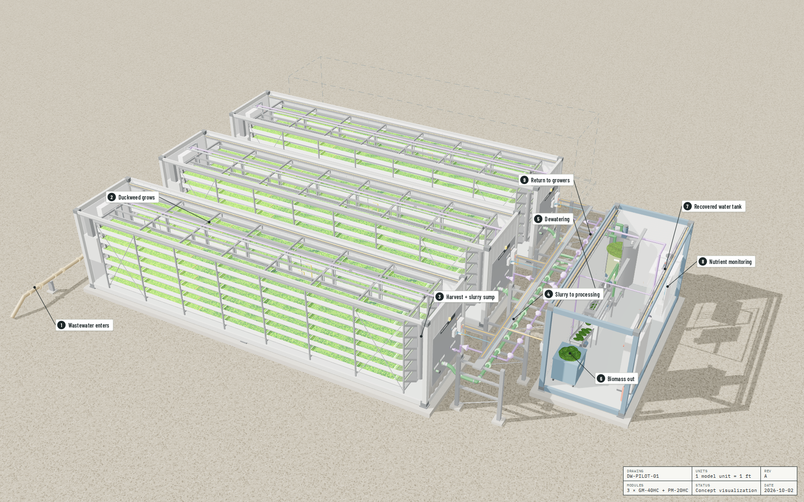
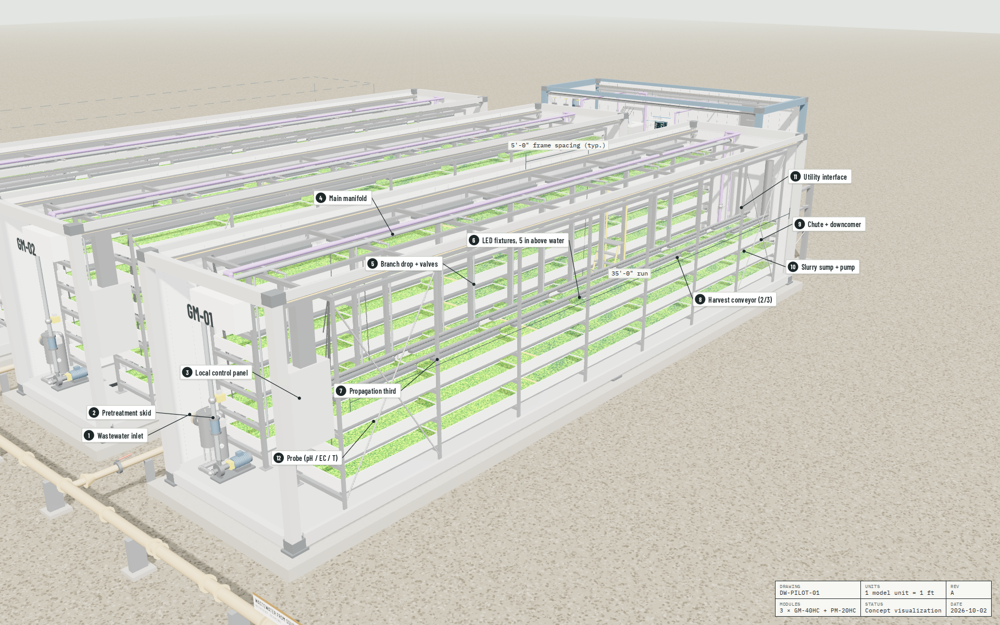
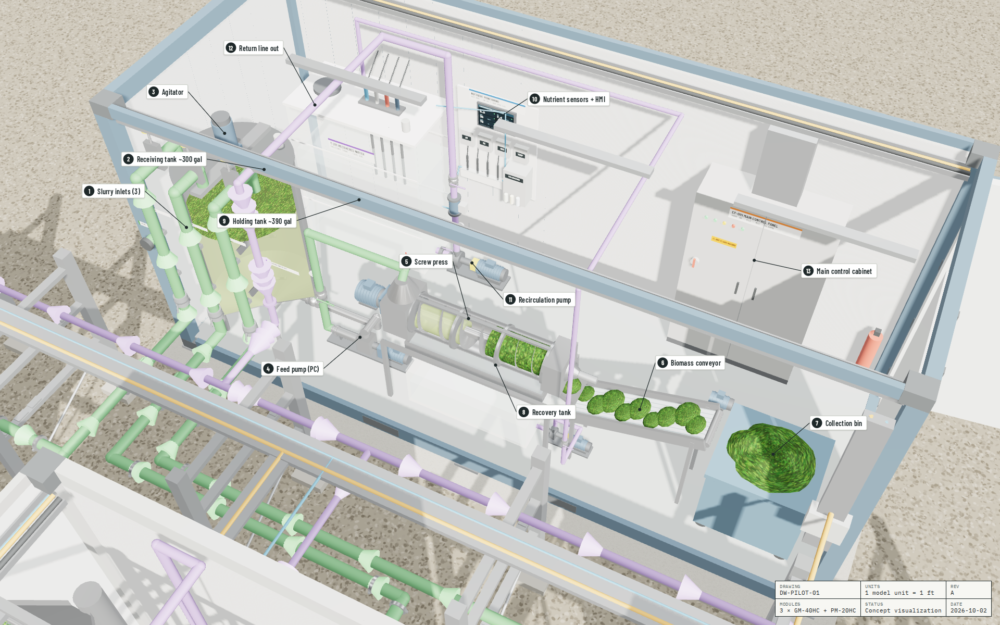

# Duckweed Module Array

Interactive 3D model (Three.js, to scale in feet) of a modular duckweed cultivation system built from shipping containers: three 40' HC growing modules feeding one 20' processing module.

Open `duckweed-module-array.html` in a browser (loads Three.js from a CDN, so it needs an internet connection).

## Layout
- **Growing modules (40' HC):** 12 runs each, 2 wall racks × 6 tiers at 1.27 ft tier pitch, runs 35 ft long.
- **Lane width 2'-8"** (not 3'-0") so a ~21" center aisle survives inside an 8' box; at 3'-0" the aisle would shrink to ~14".
- **Each run:** first third is propagation (held by a floating boom), last two thirds is harvest with a conveyor. Chutes drop to 6" downcomers, then a slurry sump and recessed-impeller pump at the utility end.
- **Processing module (20'):** set perpendicular at the end of the grower array. Biomass line on the grower-facing wall; water recovery, HMI and control panel CP-001 on the far wall.

## Color key
| Color | Line |
|---|---|
| Tan | Wastewater feed |
| Green | Duckweed slurry |
| Purple | Recovered / reclaimed water |
| Orange | Power |
| Blue | Data / controls |

## Views

